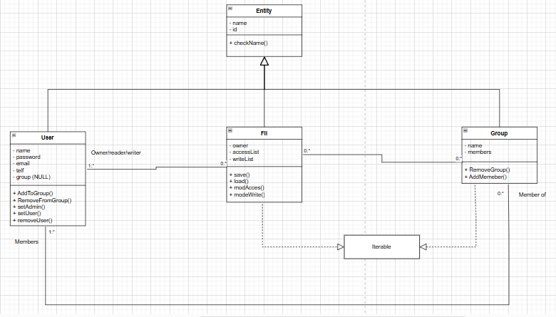

# Simple File System

Dette programmet er ment til å brukes som en måte å styre et multi-user systems ressurser. Man kan opprette flere brukere, grupper og filer, og koble dem til hverandre på en sikker måte. Appen vil også være et interface mellom sluttbrukere og systemet, og sørge på at vekommende kan logge inn og lese/skrive filer. Bruker vil også ha muligheten til å lagre endringene de har gjort, og hente i følgende kjøringer

# Diagram

# Refleksjon

1. Til å begynne med, er enkapsling og validering av objektets tilstand implementert; dette sørger for at tilstanden til et objekt ikke er direkte tilgjengelig for andre klasser, slik at valideringen kun trenges innenfor samme klassen, noe som reduserer kompleksiteten til kodebasen og gjør debugging mye lettere. 

Arv er aktivt bruk, og i dette tilfellet, har jeg valgt å se på alle klassene som en extension av klassen Entity, siden alle trenger et navn og en id. Det blir da slik at hver entitet har en unik id gjennom alle klassene, sammenlignet med å ha id og nextId for hver klasse. I tillegg, trenger man kun en funksjon (checkName) i superklassen, i stedet for å ha en slik funksjon i hver klasse (Eller kanskje jukse og bruke (checkName) av en klasse). Jeg innså litt senere at jeg kanskje måtte ikke la Fil-klassen arve fra Entity, siden filer er litt forskjellige enn brukere og grupper, i tillegg til at de kan trenge en annen checkName logikk. 

Når det kommer til grensesnitt, så har jeg brukt Iterable/Iterator for å muligjøre direkte iterasjon over Group- og Fil-objekter. For eksempel, i stedet for å iterere over write- og access-lister i Fil-klassen separert, ved å bruke funksjoner til å hente dem først, har grensesnittet muliggjort itereringen over begge dem i en løkke, samtidig som å identifisere permisjon-typen i konsollen.

Jeg tror delegering opptrer i måten kontrollerne behandler hendelsene som skjer på grensesnittet; de henter inn den nåværende brukeren fra App-klassen, og får den til å utføre oppgaven, eller delegerer fil-laging, lagring og loading til Fil-klassen. Jeg kan endre implementasjonen av kontrollerne i hvilken som helst måte, men det vil ikke påvirke de underliggende klassene som blir delegert oppgavene. 

2. Jeg tror den eneste delen av pensum ikke har blitt brukt på en synlig måte er observatør-observert-grensesnitt. Jeg har brukt en observable list for å lagre elementene fra de underliggende klassene i kontrollerne, og få endringene i dem direkte reflektert i grensesnittet. Jeg har ikke da laget et spesifikt grensesnitt som observatørene implementerer forskjellig ut fra sine egne behov. Koden trengte ikke et slikt fleksibelt funksjonalitet, men hvis jeg skulle implementere det selv, så ville jeg legge til en funksjon i superklassen som tar en pointer til listen av observatører, og gir dem beskjed når en entitet blir laget/slettet for eksempel. I tillegg vil jeg trenge å inkludere en kode som legger en vilkårlig kontroller inn som observatør.

3. Jeg tror at appen min passer med denne modellen stort sett. View-delen inneholder tre fxmls, hvor hver av dem har sin egen kontroller, som igjen bruker de underliggende API-er for å koble grensesnittet mot klassene. Dette gjør kodebasen mye mer modulær, og lettere å endre underveis om det er nødvendig.

4. under testing, har jeg valgt de mest kritiske delene av appen, hjøresteinene av hele kodebasen. For eksempel kunstrokøtrene, koden som tar argumenter direkte fra brukerne, koden ansvarlig for tilkoblingen av User/Group, og til slutt delene som er ansvarlige for saving/loading.

